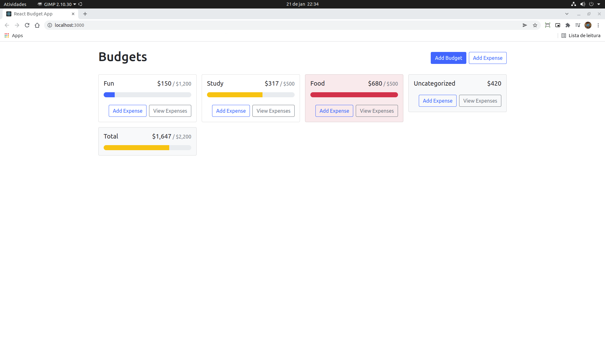

Project based on the Youtube video: "How To Create A Budget App With React" - by WebDevSimplified / Kyle

- React Basics
- React-Bootstrap
- Context API
- Hooks (useContext, useState, useEffect, useRef)
- Custom Hooks
- UUID

